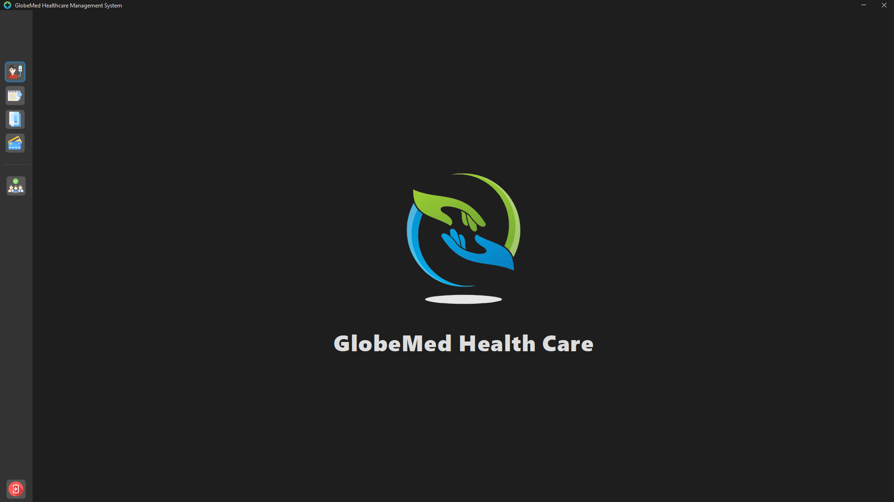

# Globe Med Healthcare 

Globe Med Healthcare is an integrated medical desktop application designed for managing hospitals, clinics, and pharmacies. The system integrates patient records, appointment scheduling, billing, insurance claims, staff role management, medical report generation, and security features into a single, efficient platform. Developed in Java, the system leverages object-oriented design patterns to ensure a maintainable, scalable, and efficient architecture.

##  Key Features 📌

- 🧑‍⚕️ Patient Record Management - Secure and role-based access to patient data
- 📅 Appointment Scheduling - Flexible booking across multiple facilities
- 💳 Billing & Insurance Claims - Decoupled processing with support for multiple claim types
- 👥 Staff Role Management - Role-based access control for doctors, nurses, pharmacists, and admins
- 📄 Medical Report Generation - Separation of report logic from core medical data
- 🔐 Security - Encryption, authentication, logging, and secure data handling

## Technologies Stack 🛠️

- **Language :** Java  
- **GUI Framework :** Java Swing  
- **IDE :** NetBeans  
- **Database :** MySQL  
- **Database Tool :** HeidiSQL, MySQL Workbench  
- **Reports :** Jasper Reports

## Design Patterns Used 🧩

This project extensively applies object-oriented design patterns to solve common architectural and design challenges in an integrated medical desktop application. Each core module is mapped to a suitable design pattern to improve maintainability, scalability, and flexibility.

### 🔸 Part A : Patient Record Management – Decorator Pattern

**Purpose :** To dynamically extend patient information such as medical history, treatment plans, and laboratory tests without modifying the core patient structure.

**Implementation :**  
- `PatientDetails` defines the base interface for patient data.
- `BasicPatientDetails` loads core patient information.
- `PatientDetailsDecorator` acts as the abstract decorator.
- Concrete decorators such as `MedicalHistoryDecorator` and `TreatmentPlanDecorator` add additional patient-related data at runtime.

**Benefits :**  
- Flexible extension of patient records  
- Follows the Open/Closed Principle  
- Improves scalability without code duplication

##

### 🔸 Part B : Appointment Scheduling – Mediator Pattern

**Purpose :** To centralize appointment coordination logic and reduce tight coupling between UI components.

**Implementation :**  
- `AppointmentMediator` interface defines appointment booking operations.
- `AppointmentMediatorService` manages consultation, diagnostic, and surgery appointments.
- The UI layer communicates with the mediator instead of handling appointment logic directly.

**Benefits :**  
- Reduced dependencies between UI components  
- Centralized and maintainable appointment logic  
- Easier testing and future enhancements  

##

### 🔸 Part C : Billing and Insurance – Bridge Pattern

**Purpose :** To separate billing services from payment processing logic, allowing independent extension of both.

**Implementation :**  
- `BillService` represents billing abstractions.
- `PaymentProcessor` defines payment execution.
- Concrete services such as `ConsultationService`, `LaboratoryTestService`, and `SurgeryService` delegate payment handling to the processor.

**Benefits :**  
- Decouples billing logic from payment methods  
- Improves flexibility and maintainability  
- Enables easy integration of new payment types  

##

### 🔸 Part D : Managing Medical Staff Roles and Permissions – Composite Pattern

**Purpose :** To manage hierarchical staff roles and permissions in a structured and unified manner.

**Implementation :**  
- `RoleComponent` defines a common interface for roles.
- `RoleGroup` represents composite roles (e.g., Admin Staff, Medical Staff).
- `RoleLeaf` represents individual roles with specific permissions.
- Permission checks are performed recursively across the hierarchy.

**Benefits :**  
- Simplifies complex role management  
- Uniform permission handling  
- Easily extendable role structure  

##

### 🔸 Part E : Generating Medical Reports – Visitor Pattern

**Purpose :** To generate different types of medical reports without modifying report object structures.

**Implementation :**  
- `ReportElement` defines the `accept()` method.
- Concrete report types include `TreatmentSummaryReport`, `DiagnosticReport`, and `FinancialReport`.
- `ReportVisitor` implementations handle report generation logic.
- JasperReports integration is handled inside visitor implementations.

**Benefits :**  
- Clean separation between data and report logic  
- Easy addition of new report types  
- Improved code readability and maintainability  

##

### 🔸 Part F : Security Considerations – Compound Pattern (Decorator + Chain of Responsibility)

**Purpose :** To implement a secure, modular, and extensible authentication mechanism.

**Implementation :**  
- **Chain of Responsibility** handles login validation steps:
  - Null or blank input validation  
  - Credential verification  
  - Account status checking
    
- **Decorator Pattern** enhances login functionality with logging using `LoggingDecorator` without modifying core login logic.

**Benefits :**  
- Structured and secure authentication flow  
- Easy to add or modify validation steps  
- Improved logging and auditability  

## User Roles and Permissions ⚙️

The system includes a robust role-based access control (RBAC) mechanism to ensure security and proper access management. Each user is assigned a specific role that determines their permissions within the system.

- **Administrator :** Full access to all modules (Patient Records, Appointments, Billing, Reports, Staff Management).
- **Doctor :** Limited to Patient Records, Appointments (Confirm or cancle appointments), Reports (Patient Summary and Diagnostic Reports).
- **Nurse :** Limited to Patient Records, Appointments and Billing (Consultation Fee).
- **Pharmacist :** Limited to Billing & Claims.

## Project Objective 🎯

The objective of **Globe Med Healthcare** is to provide a centralized medical management system that enhances workflow efficiency, minimizes manual errors, ensures data security, and improves overall patient care through an integrated desktop solution.
## Project Preview 👀

<table align="center">
  <tr>
    <td align="center">
       
      <b>Sign In Page</b>
    </td>
    <td align="center">
       
      <b>Home Page</b>
    </td>
  </tr>
</table>

To view all UI previews, please visit the 📁 [`preview_images`](./preview_images) folder.

